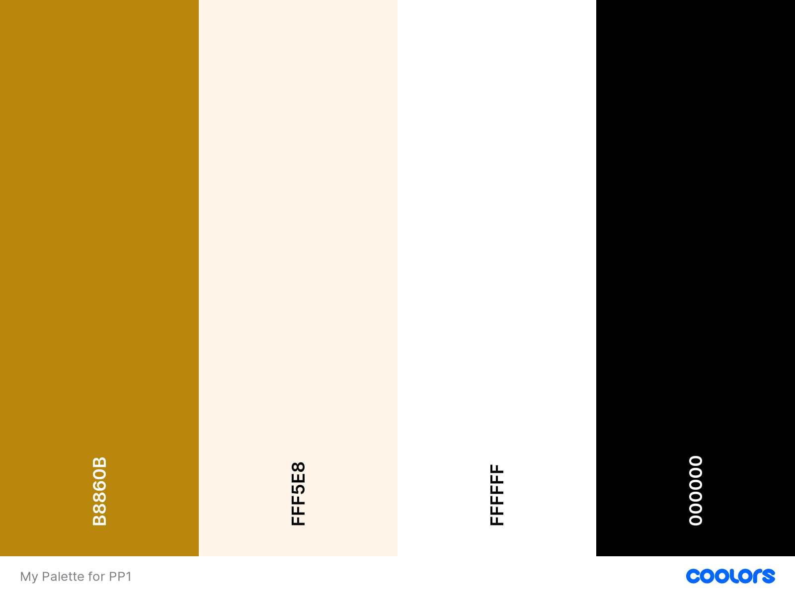
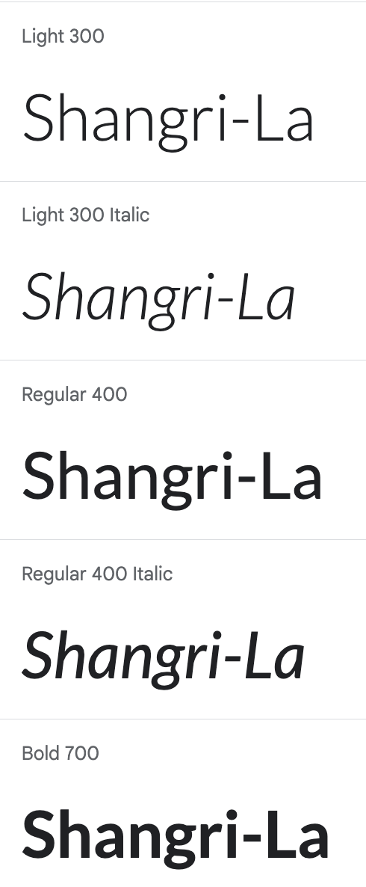
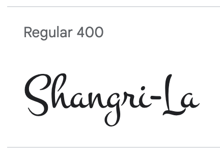
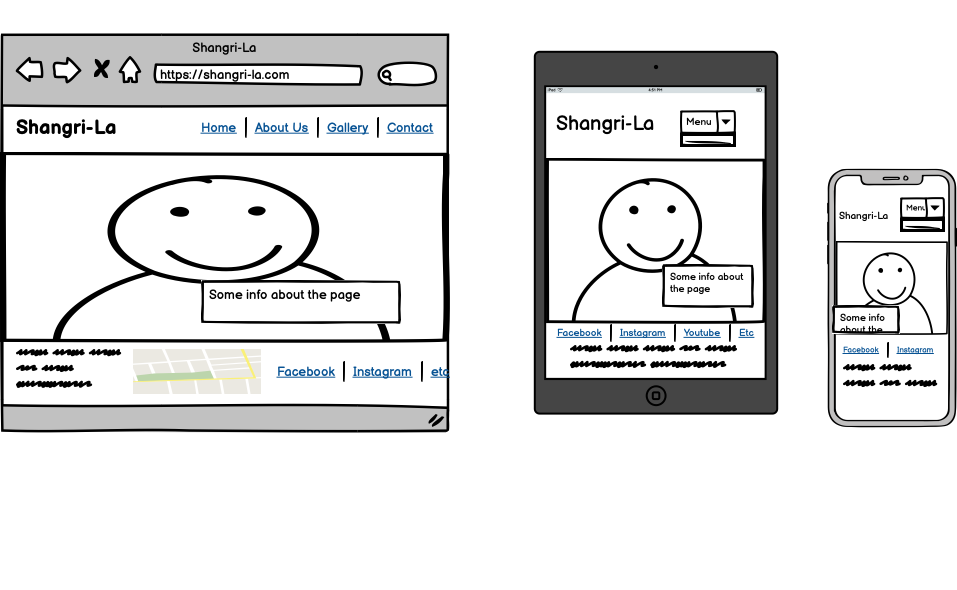

# Project 1 Shangri-La Yoga & Mindfulness

Shangri-La is an ficitonal yoga place, the website is designed to be responsive, allowing visitors to view it on a range of devices.

Visit the deployed site: [Shangri-La](https://charlieapell.github.io/shangri-la/index.html)

---

## CONTENTS

* [User Experience](#user-experience-ux)
  * [User Stories](#user-stories)

* [Design](#design)
  * [Colour Scheme](#colour-scheme)
  * [Typography](#typography)
  * [Imagery](#imagery)
  * [Wireframes](#wireframes)

* [Features](#features)
  * [General Features on Each Page](#general-features-on-each-page)
  * [Future Implementations](#future-implementations)
  * [Accessibility](#accessibility)

* [Technologies Used](#technologies-used)
  * [Languages Used](#languages-used)
  * [Frameworks, Libraries & Programs Used](#frameworks-libraries--programs-used)

* [Deployment](#deployment)

* [Testing](#testing)

* [Credits](#credits)
  * [Code Used](#code-used)
  * [Content](#content)
  * [Media](#media)
  * [Acknowledgments](#acknowledgments)

---

## User Experience (UX)
### Initial Discussion

Shangri-La is a fictional yoga place in Norrköping, Sweden. The website is built so that the user can read about the yoga place on different devices and hopefully become interested and send an email about questions or membership.

### User Stories

#### Client Goals

* To be able to view the site on a range of different device sizes.
* To make it easy for potential members to find out what Yoga is and how to take part.
* To allow people to be able to contact the Yoga Place to ask further questions.

#### First Time Visitor Goals

* I want to find out what is Shangri-La Yoga and how I can take part of it.
* I want to be able to navigate the site easily to find information.

#### Returning Visitor Goals

* I want to ask a question.
* I want to know when the next yoga lesson is.

## Design

### Colour Scheme

I chose to work with colors that are earthy for my website because "mother nature" and Yoga go hand in hand, therefore I chose colors that went in the slightly golden/brown to more off white and black.

### Typography

Google Fonts was used to import the chosen fonts for use in the site.
Montez for the logo and Latos for everything else.

https://fonts.google.com/specimen/Lato#styles

https://fonts.google.com/specimen/Montez

### Imagery

I have used stock photos from https://unsplash.com/ from different yoga places around the world

### Wireframes

I wanted to do a scroll down menu when browsing on either a tablet or phone but i didn't have the time to make it work,
so I settled for a simpler approach and placed the menu below the logo when browsing on a phone or tablet.

## Features

The website consists of five pages, with four pages available through the navigation menu (home page, about us page, gallery page and contact page). The fifth page, which provides information about Kids Yoga, can be accessed from either the schedule on the home page or the about us page.

## General features on each page

### All Pages on the website have:
* A responsive navigation bar at the top which allows the user to navigate through the site. To the left of the navigation bar is the text Shangri-La. To the right of the navigation bar are the links to the websites pages (home, about us, gallery and contact). When viewing with mobile devices the navigation links change to a smaller text placed under the text "Shangri-La", from the beginning i wanted a burger icon but uunfortunately i was running out of time.
* A footer containg the adress, a map and links to Shangri-La's social media pages.

### Home page
* Hero image from unsplash with a zoom animation to capture the users attention
* A cover text with a link in the name "Shangri-La" that takes you to the "About us"
* A schedule for upcomming yoga events, on sunday funday there's link to the "Kids Yoga"-page

### About us Page
* A text about this fictional yoga place with a link to "Contact" and "Kids Yoga".
* Stock photo from unsplash

### Gallery
* Stock photos from Unsplash with association to Yoga
* Stock video from Pixabay

### Contact
* Contact form
* Text area for questions or subjects

### Kids Yoga with Yoga the Bear
* Stock photo on a person in Bear costume
* A text about Yoga classes for kids with "Yoga the Bear"
* Link to Contact

### Future Implementations

* Use javascript to make the menu into a burger icon when browsing on a tablet or phone
* Add a booking page for yoga classes

### Accessibility

In order to make the website as accessible-friendly as possible, I have been wary while coding and accomplished this by:
* Using semantic HTML.
* Using descriptive alt and aria-labels on images and video on the site.
* I have used colors that, in contrast to each other, make it easy for the user to read the texts on the pages.
* To make menus accessible for screen readers, I have ensured that the current page is marked.

## Technologies Used

### Languages Used

HTML and CSS were used to create this website.

### Frameworks, Libraries & Programs Used

* Balsamiq - Used to create wireframes.

* Gitpod - To code the website.

* Github - To save and store the files for the website.

* Google Fonts - To import the fonts used on the website.

* Font Awesome - For the icons to the social media.

* Google Dev Tools - To test the website, solve issues with styling.

* Tiny PNG To compress images.

* Am I Responsive? To show the website image on a range of devices.

## Deployment & Local Development

### Deployment

The live website was deployed using Github Pages. Follow the instructions below to achieve this:

1. Log in to Github (or sign up if you haven't already).
2. Locate the repository for this project, which is named Shangri-La.
3. Click on the Settings link.
4. Click on the Pages link in the navigation bar on the left-hand side.
5. In the Branch section, choose "main" from the dropdown menu and select "Root" from the dropdown menu for the folder.
6. Click Save to complete the deployment. Your live Github Pages site will now be available at the URL shown.

## Testing

Please view my [TESTING.md](TESTING.md) file for more information on the testing undertaken.

## Credits

### Code Used

All of the codes used are from the LMS, w3schools and through Chrome Developer Tools.
The code for the social media in the footer was taken from Love Running.

### Content

Content for this project was written by Charlie Apell and some of the texts are filled out with ChatGPT.

###  Media

Every image used on the website is downloaded from https://unsplash.com/s/photos/yoga
and the video is from https://pixabay.com/videos/search/yoga/
  
###  Acknowledgments

Much of my inspiration for this website comes, as you can see, very much from the "Love Running" project but also from the three pages Paul had in his powerpoint.
I have also found inspiration from various students' PP1, for example Mateusz Smalarz's Ninja Ramen page and some other students yoga-pages.
If i ever got stuck i used chrome developer tool to see how other had done their coding and/or google it.
Otherwise i hade a lot of help from https://www.w3schools.com/