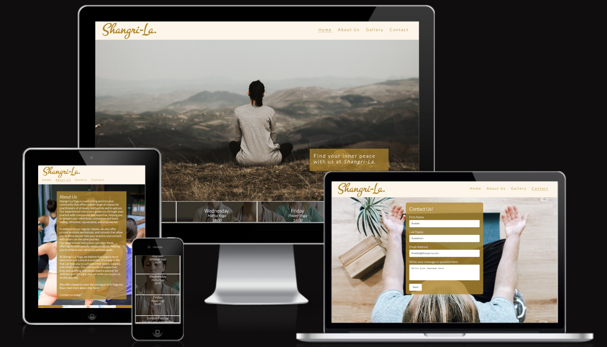

# Shangri-La -  Testing

Visit the deployed site: [Shangri-La](https://charlieapell.github.io/shangri-la/index.html)

- - -

## CONTENTS

* [AUTOMATED TESTING](#AUTOMATED-TESTING)
  * [W3C Validator](#W3C-Validator)
  * [Lighthouse](#Lighthouse)

Throughout the entire build process, I conducted ongoing testing and utilized Chrome developer tools to identify and resolve any issues as they arose. During development, I also relied on Google developer tools to verify the proper functioning of all components and troubleshoot any unexpected problems.

- - -

## AUTOMATED TESTING

### W3C Validator

[W3C](https://validator.w3.org/) was used to validate the HTML on all pages of the website. It was also used to validate the CSS.

* [index.html](documentation/testing/index.png) - Passed.
* [about.html](documentation/testing/about.png) - Passed.
* [gallery.html](documentation/testing/gallery.png) - Passed.
* [yogabear.html](documentation/testing/yogabear.png) - Passed.
* [contact.html](documentation/testing/contact.png) - Passed.

* [style.css](documentation/testing/w3css.png) - Passed.

- - -

### Lighthouse

I used Lighthouse within the Chrome Developer Tools to test the performance, accessibility, best practices and SEO of the website.

### Desktop Results

## MANUAL TESTING

`Shangri-La`

| Feature | Expected Outcome | Testing Performed | Result | Pass/Fail |
| --- | --- | --- | --- | --- |
| The Sites title | Link directs the user back to the home page | Clicked title | Home page reloads | Pass |
| The Shangri-La link on the Hero Image | Link directs the user to the About us page | Clicked Shangri-La | About us page loads | Pass |
| The About Us menu | Link directs the user to the home page | Clicked Link | About us page loads | Pass |
| The Kids Yoga link in about us | Link directs the user to the Yogabear page | Clicked Link | Yogabear page loads | Pass |
| The Contact link in both Kids Yoga and About us | Link directs the user to the Contact page | Clicked Link | About us page loads | Pass |
| The Gallery menu | Link directs the user to the gallery page | Clicked Link | Gallery page loads | Pass |
| The Contact menu | Link directs the user to the contact page | Clicked Link | Contact page loads | Pass |
| The Contact form | The user fills out form, all fields must be filled | Didn't fill out everything| Gets a warning | Pass |
| All links - hover effect | All links should get underlined when hovered over. | Hover over each link on the page | Each link displayed the correct styling when hovered over | Pass |